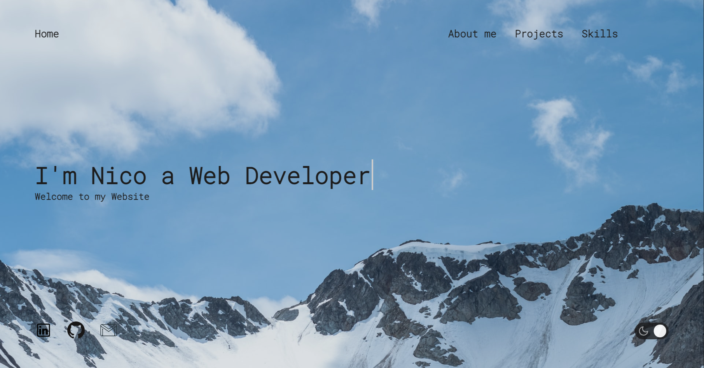

# **Personal Portfolio React Single Page Application**
## **This is my personal portfolio website where I will show my projects and other stuff**
### [Here you can see this website](https://necogamy.github.io/personal-portfolio-website/)
### *This project was bootstrapped with [Create React App](https://github.com/facebook/create-react-app).*

 

## **Overview**

## **Features**
* Fully Responsive for three devices (Desktop, Tablet and Smartphone devices)
* A bit interactive
* Good accessibility
* The topic it's that is just a personal portfolio app where I show projects, contact media and other related stuff

## **Project Objectives**
* Do my own wireframe (I will use figma) and pass that to code
* Make use of CSS3, HTML5 and JavaScript with React framework
* Needs to be fully responsive, interactive, semantic, and to take care of a11y (accessibility)

## **Built with**
* React how front-end framework
* HTML5
* CSS3
* JavaScript - ECMAScript6
* Animate CSS Library V4.1.1

## **Other Tools Used**
* Markdown for readme
* Git version control
* GitHub & GitHub pages
* NodeJS
* Figma for Wireframing
* Visual Studio Code & Bash Command Line